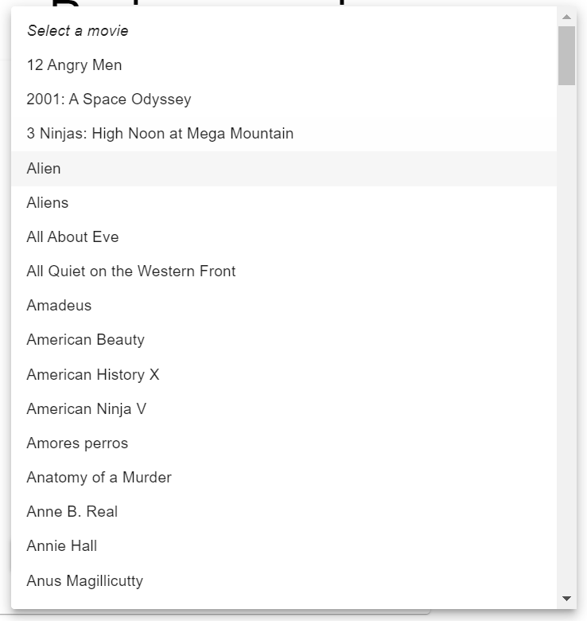
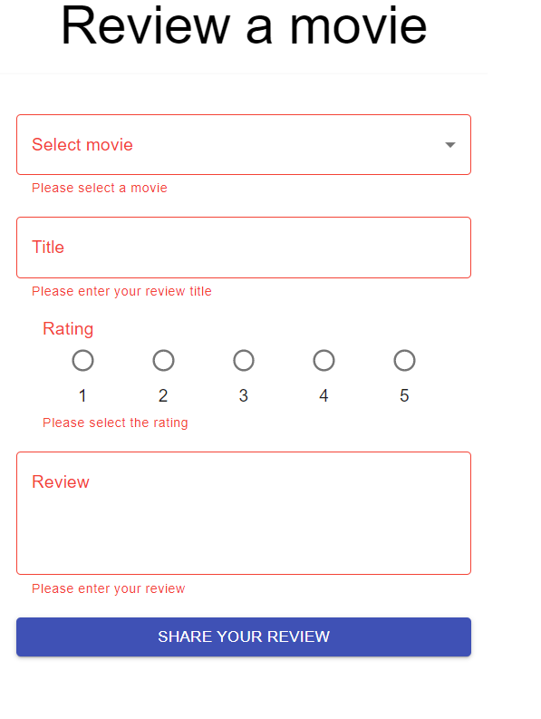
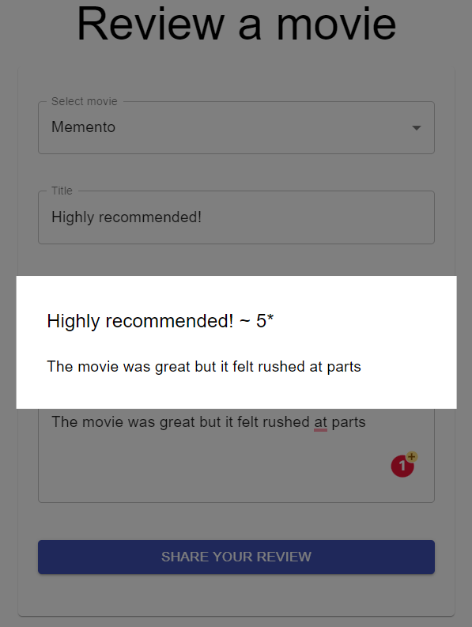
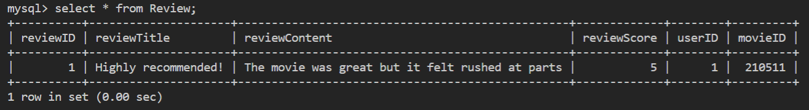

# D2 Implementation

> **Note**: I unsure if I'll be able to publish the code to the server so I'm leaving this README to explain the code. Use the dropdowns to view the step-by-step implementation process


<details> 
<summary>Step 6a</summary>

> a. Augment your copy of IMDB database (loaded in Step 1 into YourUserID database in MySQL). Specifically, create two tables specified below. In addition to the listed attributes, add Foreign Keys required to join (a) User with Review and (b) Review with Movie

<br>

> i. Table name: User Attributes: userID (Primary Key), firstName, lastName, email, phone, dateOfBirth

* userID is the primary key and it auto increments so each time a user is added, the ID is auto-assigned 

```sql
CREATE TABLE User (
	userID INT NOT NULL AUTO_INCREMENT,
	firstName VARCHAR(255),
	lastName VARCHAR(255),
	email VARCHAR(255),
	phone VARCHAR(255),
	dateOfBirth DATE,	
	PRIMARY KEY (userID)
);
```
<br>

> ii. Table name: Review Attributes: reviewID (Primary Key), reviewTitle, reviewContent (200 characters maximum), reviewScore [values: 1-5]

* Similar to userID, this table auto-assigns IDs whenever a review is added
* There are 2 foreign keys that connect this table to the movie and User tables
* Review score has a constraint where its values can only be 1, 2, 3, 4, or 5

```sql
CREATE TABLE Review (
	reviewID INT NOT NULL AUTO_INCREMENT,
	reviewTitle VARCHAR(255),
	reviewContent VARCHAR(200),
	reviewScore INT(1),	
	userID INT,
	movieID INT,
	PRIMARY KEY (reviewID),
	CHECK (reviewScore in (1,2,3,4,5)),
	FOREIGN KEY (userID) REFERENCES User(userID),
	FOREIGN KEY (movieID) REFERENCES movies(id)
);
```

</details>

<details> 
<summary>Step 6b</summary>

> b. Read the list of movies from MySQL 

<br>

> i. Upon the first render, the React code should send a request to the NodeJS POST api getMovies in server.js (see point 6.a.iv below) to retrieve the list of all movie records from the YourUserID.movies table in MySQL. 

1. The first step was connecting MySQL to `server.js` by configuring the database settings. Since the development environment is in-use, the host is *localhost*

    ```js
    const db = mysql.createPool({
        host: "localhost",
        user: "b33luo",
        password: "Password1",
        database: "b33luo"
    });
    ```

1. Next, an API was added to connect `server.js` and `index.js`. This queries all rows in the movie database and sends them as a JSON object to the frontend

    ```js
    // API to send all MySQL movie data to frontend 'Select Movie' element
    app.post('/api/getMovies', (req, res) => {
        const sqlSelect = "SELECT * FROM movies";
        db.query(sqlSelect, (err, result) => {
            res.send(result);
        });
    });
    ```

<br>

> ii. When the React code receives the list of movies, it should assign the received movies list to a stateful list movies. 

3. I added a state variable to store the incoming list of movies

    ```js
    const [movies, updateMovies] = React.useState();
    ```

1. I used the axios library as an http client to communicate between `server.js` and `index.js`: 

    ```js
    import * as axy from 'axios';
    ```

1. In the `MovieSelection` component, I added a `useEffect()` hook to call the `getMovies` api and load all movies into the `movies` state variable upon first render

    ```js
    // Auto-loading movie titles from database
    useEffect(() => {
        axy.post(url + "/api/getMovies").then((response) => {
        updateMovies(response.data);
        });
    }, []);
    ```

<br>

> iii. Write code to populate the MUI Select element (created in D1) with the values from the stateful list. 

6. The MUI select element was populated by mapping out the `movies` state variable and creating a `<MenuItem>` for each movie:

    ```js
    <MenuItem value="">
        <em>Select a movie</em>
    </MenuItem>
    {movies
        ? movies.map((item, index) => (
        <MenuItem key={index} value={item.id}>{item.name}</MenuItem>
        ))
        : null
    }
    ```

<br>

> iv. In NodeJS (server.js) create a POST api getMovies that will receive a POST request from React (point 6.a.i above), and retrieve all records of movies from the YourUserID.movies table in MySQL. For each movie, it must retrieve all fields (id, name, year, quality). Finally, the api must send the list of records as a JSON object to React.

* See above `api/getMovies`

</details>

<details> 
<summary>Step 6c</summary>

> c. Write the user-created movie review to MySQL 

<br>

> i. When the user clicks "Submit", the React should send all review data (movie id, user id, reviewTitle, reviewContent, reviewScore) to the POST api addReview in server.js. Make sure that the D1 validation checks still work, and that the code verifies that the user selects a movie from the drop-down list. Note: for D2, declare userID as a stateful variable and set it to '1'. (You will implement user signin in D3).

1. Another API is required, `addReview`, to insert the review into the database. The request body comes from the frontend form submission

    ```js
    // API to post user reviews to database
    app.post('/api/addReview', (req, res) => {
        const reviewTitle = req.body.reviewTitle;
        const reviewContent = req.body.reviewContent;
        const reviewScore = req.body.reviewScore;
        const userID = req.body.userID;
        const movieID = req.body.movieID;

        const sqlInsert = "INSERT INTO Review(reviewTitle, reviewContent, reviewScore, userID, movieID) VALUES (?,?,?,?,?)";
        db.query(sqlInsert, [reviewTitle, reviewContent, reviewScore, userID, movieID], (err, result) => {
            console.log(err);
        });
    });
    ```

1. Next, code was added to send form data to the API upon successful form completion:

    ```js
    // If no errors then output user review
    if (reviewObject.body !== "" && 
        reviewObject.rating !== "" && 
        reviewObject.movie !== "" && 
        reviewObject.title !== "") {

        // Open modal to display review
        handleOpen();

        // API to send review to database
        axy.post(url + '/api/addReview', {
            reviewTitle: reviewObject.title,
            reviewContent: reviewObject.body,
            reviewScore: reviewObject.rating,
            userID: userID,
            movieID: reviewObject.movie
        })

    }
    ```

1. The userID was hardcoded as a state variable with value 1:

    ```js
    // D2: Hardcoded userID
    const [userID, setUser] = React.useState(1);
    ```

1. Validation checks were added for the `MovieSelection` component:

    ```js
    // States: Errors
    const [errorMovie, triggerErrorMovie] = React.useState(false);

    ...

    // Form submission
    const handleSubmit = (event) => {
    event.preventDefault();

    // Validation
    reviewObject.movie === "" ? triggerErrorMovie(true) : triggerErrorMovie(false)

    ...

    return (
        ...
        <Grid xs={12} item>
        <MovieSelection
            movie={movie}
            onChange={selectedMovie}
            error={errorMovie}
            helperText={errorMovie ? "Please select a movie" : " "}
        />
        </Grid>
    )

    ...

    // MovieSelection component
    <TextField
        ...
        helperText={props.helperText}
        onChange={handleChange}
    >
    ```

<br>

> ii. In server.js implement a POST api addReview, which receives usercreated review from React, and inserts the data into the appropriate tables in the YourUserID database in MySQL.

* See above `api/addReview`

</details>

<br>

## Functionality

1. Access the user form via `yarn dev`. Forward `Port 5000` in VSCode if it's not automatically forwarded. Submit to see form validation




2. Complete the form and press submit to open the modal and send review to MySQL database



3. View the entry in MySQL


